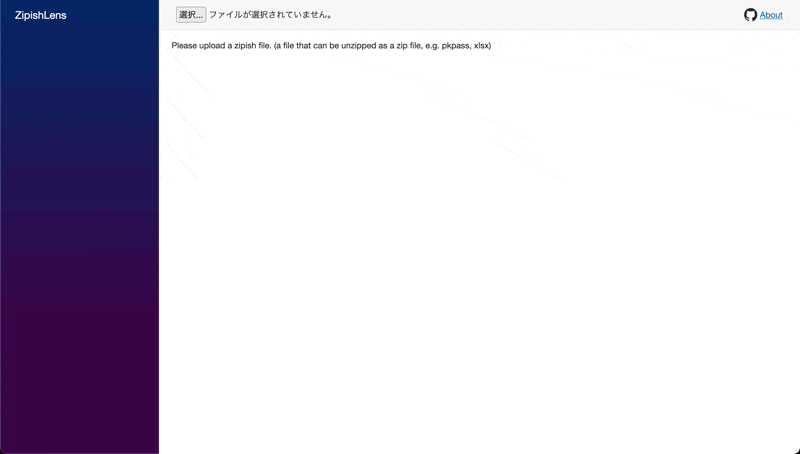

# ZipishLens

[https://zipish-lens.muno92.dev/](https://zipish-lens.muno92.dev/)

Web viewer for zipish file by WebAssembly.  
(_zipish_ file is a file that can be unzipped as a zip file, e.g. pkpass, xlsx)
